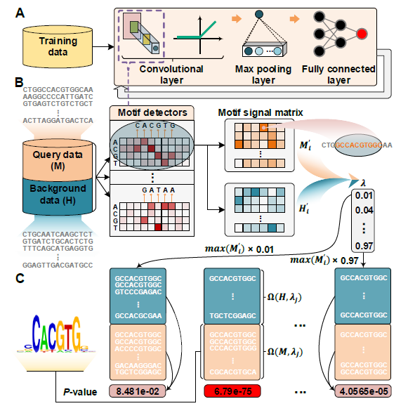

# DESSO (DEep Sequence and Shape mOtif) 

DESSO is a deep learning-based framework that can be used to accurately identify both sequence and shape regulatory motifs from the human genome.

<p align="center"> 

</p>

<p align="center"><b>Figure: The model workflow</b></p>

## 1. Environment setup

#### 1.1 Create and activate a new virtual environment

Users have their own choice of how to install required packages. But to efficiently manage the installation packages, Anaconda is recommended. After installing Annocoda, it would also be an good option to use virtual environment in annocoda. `conda activate` can be used to activate a virtual environment, and then install required packages. If users want to exit the virtual environment, simply type `conda deactivate`. 

#### 1.2 Install the package and other requirements

Download and extract the source code for DESSO and move to parent directory, type following commands:

```
unzip DESSO.zip
cd DESSO
```
#### 1.3 Prerequisites and Dependencies

- Tensorflow 1.1.0 [[Install]](https://www.tensorflow.org/install/)
- CUDA 8.0.44
- Python >= 3.6
- Biopython 1.7.0
- Scikit-learn

**Note**

If you want to train your DESSO model on human ChIP-seq data then

- Download [GRCh37.p13.genome.fa](https://bmblx.bmi.osumc.edu/downloadFiles/DESSO/GRCh37.p13.genome.fa.zip) and [encode_101_background](https://bmblx.bmi.osumc.edu/downloadFiles/DESSO/encode_101_background.zip), then unzip them and put them into `data/` directory.
- `data/encode_101`, `data/encode_1001`, and `data/TfbsUniform_hg19_ENCODE` only contain wgEncodeEH002288-related data as an example, owing to the file size limit. To access the source code and whole datasets (totally about 5.9GB) without additional manipulation, just click on [code+whole data](https://bmblx.bmi.osumc.edu/downloadFiles/DESSO/DESSO-master-whole.zip).

## 2. Data information

#### 2.1 Data processing
In this part, we will first introduce the **data information** used in this model, then introduce the training **data formats**, and finally introduce how to create a data set that meets the model requirements.

We have provided example data format compatible with DESSO input data (DESSO input data format: See `data/encode_201/ABF2_AC.seq.gz`. If you are trying to train DESSO with your own data, please process your data into the same format as given in above example input data.

If you want to preprocess your TF-species specific input bed file to DESSO input file format, for an example `/data/ABF2/ABF2.bed`.

Therefore, you need to download genome file for your species of interest and place both TF-specific bed file and genome in the [data/] directory.
For example: 
- Download [GCF_000001735.3_TAIR10_genomic.fna.gz](https://ftp.ncbi.nlm.nih.gov/genomes/refseq/plant/Arabidopsis_thaliana/all_assembly_versions/GCF_000001735.3_TAIR10/) and put them into `data/` directory.
- Install bedtools to extract DNA sequences from bed file.

Therefore, run the following commands in the parent directory in Linux terminal:

```
cd data/
wget https://ftp.ncbi.nlm.nih.gov/genomes/refseq/plant/Arabidopsis_thaliana/all_assembly_versions/GCF_000001735.4_TAIR10.1/GCF_000001735.4_TAIR10.1_genomic.fna.gz
cd ../code
```
- Input data pre-processing for TFBS bed file:

**Note that** the bed file format must contain four columns:

```
chr5	9830161	9830361 	123
chr2	17042539	17042739 	123
chr2	15771721	15771921 	123
chr2	15784233	15784433 	123
```
- Run this command to construct the DESSO specified input sequences:

```
python3 processing_peaks.py --name ../data/ABF2/ABF2.bed --peak_flank 100
```
**Output** Above command will generate three files, namely `data/encode_201/ABF2_AC.seq.gz`, `data/encode_201/ABF2_B.seq.gz`, `data/encode_201/ABF2_encode.seq.gz` , that would be saved to the `data/encode_201/` directory. Here first two files are used for training and testing purpose.

| Arguments        | Description                                                               |
| ---------------- | ------------------------------------------------------------------------- |
| --name     	   | Path of bed file							       |
| --peak_flank     | Number of flanking base pairs at each side of peak summit (default is 50) |


## 3. Model Training Based on Convolutional Neural Network (CNN)

#### 3.1 Training of the model
**Input:** `ABF2_AC.seq.gz`,`ABF2_B.seq.gz`. 

All data input files need to be placed in the same folder before training, such as in `data/encode_201/`. If you are trying to train DESSO with your own data, please process your data into the same format as it.

 - if you have your own dataset in FASTA format file, then process the file as shown below containing of four columns with tab separated and first line must contain FoldID, Event, sequence and label as well:
```
FoldID	Event	sequence	label
A	peaks	GCGCAAGGCCCATAATATTTTTAGTTATTAAAAAAATTAGCAGACGTAGGGTTGACTTAAAAAAGACTCTTATTACATTAGTCGACAAGTAAAAAACACGTGGCATATATTGTGCGTTCGTAGAGACTGTAATAAAGACGGAGAGATTCTTCTAGAGTCAGTTCTTCTTCTTCATCCTCTTCTTCCCCCCAAATCCTCTCT	1
A	peaks	AACTTTAATTAGTAAAATAGATTTGGCTAAACAAATAAAAAAAACTTTTAGGCTAAAAATTGGATTTGACGTATGAGTAATTGGGGATGAGGGGGACACGTGTCAGAAAATGGGAATGGTATCTTTTGGGGAAAGCATGTAAGTGTGTAATAATGGTCCCCTTCTCTCTCCCATAACCCTACCAAAAATACTTTTCTTTGT	1

```
Now run following command:

```
python3 train.py --start_index 0 --end_index 1 --peak_flank 100 --network CNN --feature_format Seq
```

| Arguments        | Description                                                               |
| ---------------- | ------------------------------------------------------------------------- |
| --start_index    | Start index of the ChIP-seq datasets                           |
| --end_index      | END index of the ChIP-seq datasets                             |
| --peak_flank     | Number of flanking base pairs at each side of peak summit (default is 50) |
| --network        | Neural network used in model training (default is CNN)                    |
| --feature_format | Feature format of the input (default is Seq)                              |

`--start_index 0 --end_index 1` indicates the first dataset (i.e., ABF2). For example, to train models for the second and third datasets, use `--start_index 1 --end_index 3` <br/>
`--peak_flank 50` indicates the peak length is (2 \* 50 + 1) = 101 base pairs <br/>
`--network` indicates that CNN is used here <br/>
`--feature_format` can be Seq or DNAShape, where Seq indicates the input is DNA sequences, DNAShape indicates the input is the combination of four DNA shape features (i.e., HelT, MGW, ProT, and Roll).

**Final output:**
If ```--feature_format Seq``` was used, the trained model can be found at ```/output/encode_201/gc_match/ABF2/Seq/CNN```, together with ```Test_result.txt``` containing al the performance metrics of the trained model in predicting TF-DNA binding specificity on the test data. <br/>
If ```--feature_format DNAShape``` was used, the trained model is located at ```/output/encode_201/gc_match/ABF2/DNAShape/CNN```.

#### 3.2 Prediction on test datset
```
python3 predict.py --start_index 0 --end_index 1 --peak_flank 100 --network CNN --feature_format Seq --start_cutoff 0.01 --end_cutoff 1 --step_cutoff 0.03
```
Arguments | Description
----------|----------------------------------------------------------
--start_cutoff | Start of the motif cutoff interval (default is 0.01)
--end_cutoff | End of the motif cutoff interval (default is 1)
--step_cutoff | Increament of the cutoff (default is 0.03)

`--feature_format Seq` indicates that sequence motifs will be predicted. To identify shape motifs, use `--feature_format DNAShape` instead.

**FInal Output**
For `--feature_format Seq`, the predicted sequence motifs are in `output/encode_101/gc_match/ABF2/Seq/CNN/0`. <br/>
For `--feature_format DNAShape`, four kinds of shape motifs would be predicted.

**Note that** 
if you want to train DESSO with your own negative dataset (non-TFBS sites), then open file `train.py` and open the comment on line numbers 71 and 85 and comment out line 70 and 84.
- Your own dataset in FASTA format file with negative dataset must contain four columns with tab separated as shown below.

```
FoldID	Event	sequence	label
A	peaks	GCGCAAGGCCCATAATATTTTTAGTTATTAAAAAAATTAGCAGACGTAGGGTTGACTTAAAAAAGACTCTTATTACATTAGTCGACAAGTAAAAAACACGTGGCATATATTGTGCGTTCGTAGAGACTGTAATAAAGACGGAGAGATTCTTCTAGAGTCAGTTCTTCTTCTTCATCCTCTTCTTCCCCCCAAATCCTCTCT	1
A	peaks	AACTTTAATTAGTAAAATAGATTTGGCTAAACAAATAAAAAAAACTTTTAGGCTAAAAATTGGATTTGACGTATGAGTAATTGGGGATGAGGGGGACACGTGTCAGAAAATGGGAATGGTATCTTTTGGGGAAAGCATGTAAGTGTGTAATAATGGTCCCCTTCTCTCTCCCATAACCCTACCAAAAATACTTTTCTTTGT	1
A	peak	TGTAAATAAATTGTGTAGCTAATTTGATCTATACAACTATTATTTTTATTAAATATCTATATTTAATCTTATTGTATAAACTTTTTGTTTTACAGCCGACAATTTTTTTTTTTTTTAATATAAAAACATCAGGTTTTGATGAGTGATCTGTTAACAGGGAACGGTCCTACAAAAAGGAACATAGTATACTCTTGATTTTAT	0
A	peak	GAATAGTACGAAAGTAGAGGTGAAACCTTTTTATAATGAAGAGGAAACATTAATTAGCAAGAACCTACATCACATATATTATATATAAGTTCAAACTGCTAAAGATAAAAGTGATTTAATATATACTTGCATTTTTCATTATTAGCAGTCTATCACATGATTCTTTAAGAATAGGTTTGGCTTAGCTAAATTTTTTTTTGG	0
```

Save the `train.py` file and run above mentioned commands for training and prediction with your own negative dataset.

## 4. Predict TF-DNA Binding Specicitity Using Gated-CNN (GCNN) and Long DNA Sequence
#### 4.1 Train and test model
**Input:** `ATF3_A549_ATF3_HudsonAlpha_wgEncodeEH002288_AC.seq.gz`,`ATF3_A549_ATF3_HudsonAlpha_wgEncodeEH002288_B.seq.gz` located at `data/encode_1001/`.
```
cd code/
python3 train.py --start_index 0 --end_index 1 --peak_flank 500 --network GCNN --feature_format Seq
```
`--network GCNN` indicates that GCNN is used for model training <br/>
`--peak_flank 500` indicates that the peak length is (2 \* 500 + 1) = 1001 base pairs <br/>

**Final output**

The trained model and its performace metrics `Test_result.txt` on test data is located at `output/encode_1001/gc_match/wgEncodeEH002288/Seq/GCNN`.

## Citation

If you use DESSO in your research, please cite the following paper:</br>
Jinyu Yang, Anjun Ma, Adam D. Hoppe, Cankun Wang, Yang Li, Chi Zhang, Yan Wang, Bingqiang Liu, and Qin Ma,
"[Prediction of regulatory motifs from human Chip-sequencing data using a deep learning framework](https://academic.oup.com/nar/article/47/15/7809/5542889)",<br/>
Nucleic Acids Research 47, no. 15 (2019): 7809-7824.
