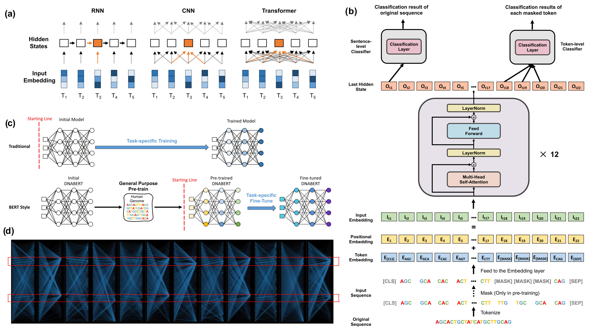

# DNABERT
## Introduction
This repository includes the implementation of 'DNABERT: pre-trained Bidirectional Encoder Representations from Transformers model for DNA-language in genome'.

 In this package, we provides resources including: source codes of the DNABERT model, usage examples, pre-trained models, fine-tuned models and visulization tool. Training of DNABERT consists of general-purposed pre-training and task-specific fine-tuning.
 <p align="center"> 

</p>
<p align="center"><b>Figure: The model workflow</b></p>

## 1. Environment setup

#### 1.1 Create and activate a new virtual environment

Users have their own choice of how to install required packages. But to efficiently manage the installation packages, Anaconda is recommended. After installing Annocoda, it would also be an good option to use virtual environment in annocoda. `conda activate` can be used to activate a virtual environment, and then install required packages. If users want to exit the virtual environment, simply type `conda deactivate`. 

#### 1.2 Install the package and other requirements

Install pytorch using following command:

```
python3 -m pip install --pre torch torchvision -f https://download.pytorch.org/whl/nightly/cu111/torch_nightly.html -U
```

To download and extract the source code for DNABERT and move to parent directory, type following commands:

```
unzip DNABERT.zip
python3 -m pip install --editable .
cd examples
python3 -m pip install -r requirements.txt
```

## 2. Pre-train (Skip this section if you fine-tune on pre-trained models)

#### 2.1 Data processing
In this part, we will first introduce the **data information** used in this model, then introduce the training **data formats**, and finally introduce how to create a data set that meets the model requirements.

We have provided example data format compatible with DNABERT input data format (See `example/ABF2/train.tsv`). If you are trying to fine-tune DNABERT with your own data, please process your data into the same format as it. Note that the sequences are in kmer format, so you will need to convert your sequences into that. We also provide a custom python program `seq2kmer.py` in the parent directory for this conversion.

Run this customized python script to convert FASTA sequences into *k*-mers:

```
python3 seq2kmer.py your_fasta_file.fa > output_file.tsv
```
For example:
For training dataset: output file (train.tsv)
For testing dataset: output file (dev.tsv)

## 3. Model Training Based on Transformer
#### 3.1 Training of the model on your own dataset
**Input:** `train.tsv`,`dev.tsv`. 
All data input files need to be placed in the same folder before training, such as in `example/ABF2`. If you are trying to train DNABERT with your own data, please process your data into the same format as defined above.

**Usage:**
Run the following command in parent directory:

```
export KMER=6
export TRAIN_FILE=examples/ABF2/train.tsv
export TEST_FILE=examples/ABF2/dev.tsv
export OUTPUT_PATH=examples/ABF2/

python3 examples/run_pretrain.py \
    --output_dir $OUTPUT_PATH \
    --model_type=dna \
    --tokenizer_name=dna$KMER \
    --do_train \
    --train_data_file=$TRAIN_FILE \
    --do_eval \
    --eval_data_file=$TEST_FILE \
    --mlm \
    --gradient_accumulation_steps 25 \
    --per_gpu_train_batch_size 10 \
    --per_gpu_eval_batch_size 6 \
    --save_steps 500 \
    --save_total_limit 20 \
    --max_steps 200000 \
    --evaluate_during_training \
    --logging_steps 500 \
    --line_by_line \
    --learning_rate 4e-4 \
    --block_size 512 \
    --adam_epsilon 1e-6 \
    --weight_decay 0.01 \
    --beta1 0.9 \
    --beta2 0.98 \
    --mlm_probability 0.025 \
    --warmup_steps 10000 \
    --overwrite_output_dir \
    --n_process 24
```

**Output:** 

**Final result** 

The trained model and best hyperparameter are saved to defined (`output/`) directory. 

In the following example, we use DNABERT with *k*-mer=6 as example.

## 3 Fine-tune (Skip this section if you use fine-tuned model)

#### 3.1 Download pre-trained DNABERT

[DNABERT3](https://drive.google.com/file/d/1nVBaIoiJpnwQxiz4dSq6Sv9kBKfXhZuM/view?usp=sharing)

[DNABERT4](https://drive.google.com/file/d/1V7CChcC6KgdJ7Gwdyn73OS6dZR_J-Lrs/view?usp=sharing)

[DNABERT5](https://drive.google.com/file/d/1KMqgXYCzrrYD1qxdyNWnmUYPtrhQqRBM/view?usp=sharing)

[DNABERT6](https://drive.google.com/file/d/1BJjqb5Dl2lNMg2warsFQ0-Xvn1xxfFXC/view?usp=sharing)

Download the pre-trained model into `examples/` directory at the same place where your training and testing data is present. (If you would like to replicate the following examples, please download DNABERT6 model). Then unzip the package by running:

```
unzip 6-new-12w-0.zip
```

#### 3.2 Fine-tune with pre-trained model

In the following example, we use DNABERT with *k*-mer=6 as example.

**Data processing**
In this part, we will first introduce the **data information** used in this model, then introduce the training **data formats**, and finally introduce how to create a data set that meets the model requirements.

We have provided example data format compatible with DNABERT input data format (See `example/ABF2/train.tsv`). If you are trying to fine-tune DNABERT with your own data, please process your data into the same format as defined above. Note that the sequences are in *k*-mer format, so you will need to convert your FASTA format sequences into that. We also provide a custom python program `seq2kmer.py` in the parent directory for this conversion.

Run this customized python script to convert positive (label 1) and negative sequences (label 0) into *k*-mers:

```
cd examples/
python3 seq2kmer.py your_fasta_file.fa 1 > output_file_pos.tsv # label 1 for positive dataset
python3 seq2kmer.py your_fasta_file.fa 0 > output_file_neg.tsv # lable 0 for negative dataset
```
Split both postive and negative data to train and test dataset by running this customized python script:

```
python3 train_test.py output_file_pos.tsv output_file_neg.tsv ABF2/train.tsv ABF2/dev.tsv
```
For training dataset: output file (train.tsv)
For testing dataset: output file (dev.tsv)

#### 3.3 Model Training Based on Transformer
- **Training** 
**Input:** `train.tsv`,`dev.tsv`. 
All data input files need to be placed in the same folder before training, such as in `example/ABF2`. If you are trying to train DNABERT with your own data, please process your data into the same format as it.

**Usage:**
```
export KMER=6
export MODEL_PATH=examples/6-new-12w-0/
export DATA_PATH=examples/ABF2/
export OUTPUT_PATH=examples/ABF2/

python3 examples/run_finetune.py \
    --model_type dna \
    --tokenizer_name=dna$KMER \
    --model_name_or_path $MODEL_PATH \
    --task_name dnaprom \
    --do_train \
    --do_eval \
    --data_dir $DATA_PATH \
    --max_seq_length 100 \
    --per_gpu_eval_batch_size=32   \
    --per_gpu_train_batch_size=32   \
    --learning_rate 2e-4 \
    --num_train_epochs 5.0 \
    --output_dir $OUTPUT_PATH \
    --evaluate_during_training \
    --logging_steps 100 \
    --save_steps 4000 \
    --warmup_percent 0.1 \
    --hidden_dropout_prob 0.1 \
    --overwrite_output \
    --weight_decay 0.01 \
    --n_process 8
```
**Output:** 

**Final result** 
With the above command, we can fine-tuned our model by using pre-trained DNABERT model on 6-*k*-mer and it will be loaded from `examples/6-new-12w-0/`. This fine-tuned model is saved into `examples/ABF2/` directory.

## 3.4 Prediction
**Prediction on test dataset**
After the model is fine-tuned, we can get prediction score by running following command:

```
python3 examples/run_finetune.py --model_type dna --tokenizer_name=dna6 --model_name_or_path examples/ABF2/ --task_name dnaprom --do_predict --data_dir examples/ABF2/ --max_seq_length 200 --per_gpu_pred_batch_size=128 --output_dir examples/ABF2/ --predict_dir examples/ABF2/ --n_process 48
```

To get evaluation metrics, run the following command by using prediction score that are generated above:

```
cut -f2 examples/ABF2/dev.tsv | sed 1d > examples/ABF2/label.txt 
python3 examples/txt2npy.py examples/ABF2/label
python3 examples/compute_result.py --pred_path examples/ABF2/pred_results.npy --label_path examples/ABF2/label.npy --name ABF2
```
**Output:** 

**Final result** 
Using above commands, the fine-tuned DNABERT model will be loaded from `examples/ABF2`, and makes prediction on the `dev.tsv` file and save the prediction result at `examples/ABF2` in `pred_results.npy`. The evaluation metrics on test dataset (`dev.tsv`) is saved in the `ABF2_result.txt` file at `examples/ABF2/` location.

## Citation
If you have used DNABERT in your research, please kindly cite the following publication:</br>
"[DNABERT: pre-trained Bidirectional Encoder Representations from Transformers model for DNA-language in genome ](https://academic.oup.com/bioinformatics/article/37/15/2112/6128680)",<br/>
Bioinformatics, 37, Issue 15, 2112–2120 (2021).
