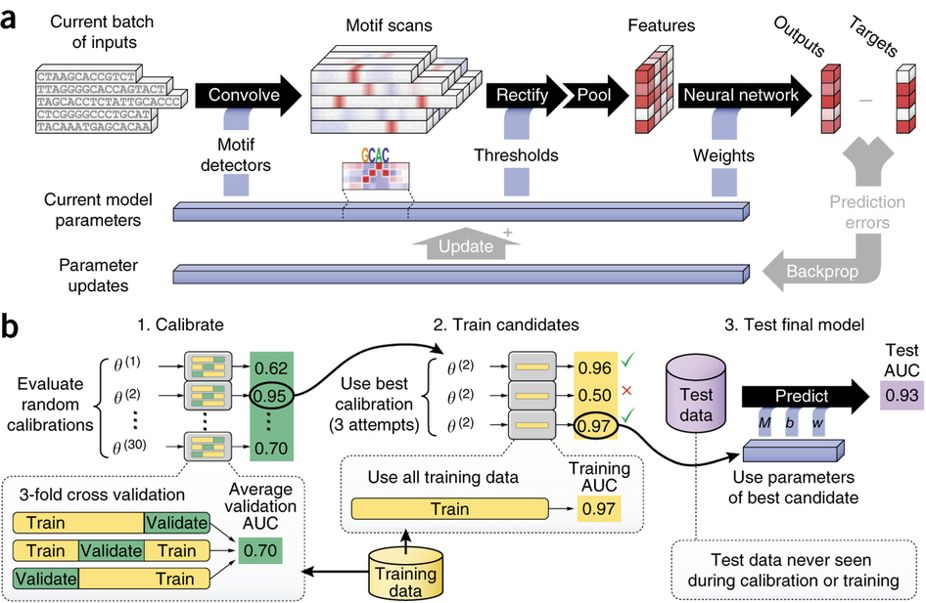

# DeepBind
## Introduction

This repository contains a PyTorch implementation of DeepBind model introduced in 2015. The model, as described in the paper titled ["Predicting the sequence specificities of DNA and RNA-binding proteins by deep learning"](https://www.nature.com/articles/nbt.3300), has been implemented in PyTorch. The PyTorch implementation was adapted from the ["DeepBind-with-PyTorch"](https://github.com/MedChaabane/DeepBind-with-PyTorch) repository.

For a detailed explanation of the model's architecture, you can refer to the supplementary notes of the paper [supplementary notes of the paper](https://static-content.springer.com/esm/art%3A10.1038%2Fnbt.3300/MediaObjects/41587_2015_BFnbt3300_MOESM51_ESM.pdf).

The architecture of the model and the calibration phase steps are illustrated in **Figure** from the paper.

<p align="center">

</p>
<p align="center"><b>Figure: The model workflow</b></p>

## 1. Environment setup

#### 1.1 Create and activate a new virtual environment

Users have the flexibility to choose how they install the necessary packages. However, for efficient package management, we recommend using Anaconda. Once Anaconda is installed, creating and utilizing a virtual environment within Anaconda is a wise option. You can activate a virtual environment with `conda activate` and proceed to install the required packages. If you wish to exit the virtual environment, simply type `conda deactivate`. 

#### 1.2 Install the package and other requirements

Run the folllowing command to install PyTorch:

```
python3 -m pip install --pre torch torchvision -f https://download.pytorch.org/whl/nightly/cu111/torch_nightly.html -U
```
***software list***
- python >=3.6
- pytorch
- numpy 
- pandas
- sklearn
- scipy 
- matplotlib

Next, unzip the package by executing the following command:

```
unzip DeepBind.zip
```

## 2. Data information

#### 2.1 Data processing

In this part, we will first introduce the **data information** used in this model, then describe the training **data formats**, and finally introduce how to create a data set that meets the model requirements.

We have provided an example data format compatible with DeepBind input data (DeepBind input data format: See `example/ABF2_train.txt`). If you are trying to train DeepBind with your own data, please process your data into the same format as given in the above example input data.

## 3. Model Training Based on Convolutional Neural Network (CNN)
#### 3.1 Training and testing 
**Input:** `ABF2_train.txt`, `ABF2_test.txt`. 
All data input files need to be placed in the same folder before training, such as in the `example/` directory.

**Usage:**
Run the following command in the parent directory:
```
python3 deepbind.py ABF2
```
**Output:** 

**Final result** 
The trained model and best hyperparameter, `ABF2_Model.pth` and `ABF2_best_hyperpamarameters.pth`, are saved in the `output/` directory, respectively. 
The output file `ABF2_result.txt` located in the `output/` directory contains the performance metrics of the test dataset.

**Note:** A warning massage may appear at the end of the execution of the command as shown below. Please ignore this warning.
```/user_path/python3.8/site-packages/numpy/core/fromnumeric.py:3419: RuntimeWarning: Mean of empty slice.
  return _methods._mean(a, axis=axis, dtype=dtype,
/user_path/python3.8/site-packages/numpy/core/_methods.py:188: RuntimeWarning: invalid value encountered in double_scalars
  ret = ret.dtype.type(ret / rcount)
nan
```

## Citation

If you use DeepBind in your research, please cite the following paper:</br>
"[Predicting the sequence specificities of DNA- and RNA-binding proteins by deep learning](https://www.nature.com/articles/nbt.3300)",<br/>
Nature Biotechnology 33, 831–838 (2015).
