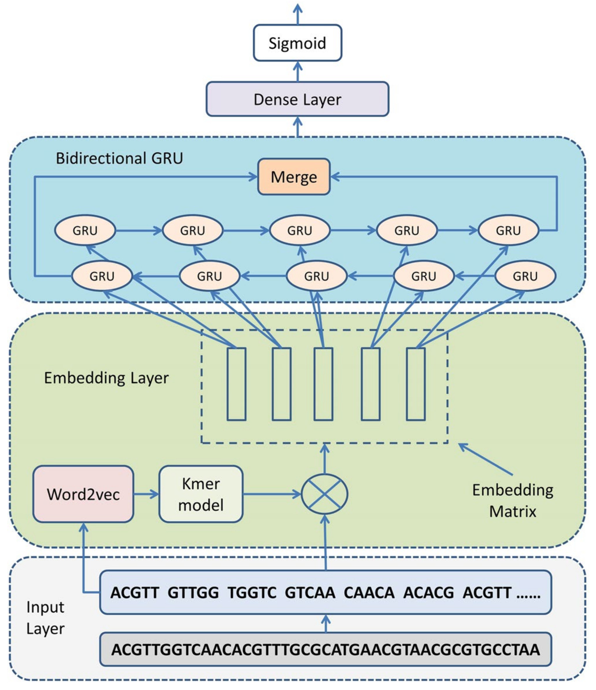

# KEGRU
## Introduction
KEGRU, a model, to identify TF binding sites by combining Bidirectional Gated Recurrent Unit (GRU) network with *k*-mer embedding.

The architecture of the model and the calibration phase steps are explained in this **Figure 1** from the paper:

<p align="center">

</p>
<p align="center"><b>Figure: The model workflow</b></p>

## 1. Environment setup

#### 1.1 Create and activate a new virtual environment

Users have their own choice of how to install required packages. But to efficiently manage the installation packages, Anaconda is recommended. After installing Annocoda, it would also be an good option to use virtual environment in annocoda. `conda activate` can be used to activate a virtual environment, and then install required packages. If users want to exit the virtual environment, simply type `conda deactivate`. 

#### 1.2 Install the package and other requirements

Install pytorch using following command:

```
python3 -m pip install --pre torch torchvision -f https://download.pytorch.org/whl/nightly/cu111/torch_nightly.html -U
```

To download and extract the source code for KEGRU and move to parent directory, type following commands:

```
unzip kegru.zip
```

#### 1.3 Software Requirements

**software list**
- python >=3.6
- pytorch
- numpy 
- pandas
- sklearn
- scipy 
- matplotlib

## 2. Data information

#### 2.1 Data processing
In this part, we will first introduce the **data information** used in this model, then introduce the training **data formats**, and finally introduce how to create a data set that meets the model requirements.

We have provided example data format compatible with KEGRU input data format (See `example/ABF2_pos.txt`). If you are trying to train KEGRU with your own data, please process your data into the same format as defined above. Note that the sequences are in *k*-mer format, so you will need to convert your FASTA format sequences into that. We also provide a custom python program `seq2kmer.py` in the parent directory for this conversion.

```
python3 seq2kmer.py your_fasta_file.fa 1 > output_file_pos.tsv 

```
Split both postive and negative data to train and test dataset by running this customized python script:

```
python3 train_test.py output_file_pos.tsv output_file_neg.tsv ABF2_pos.txt ABF2_neg.txt
```
For training dataset: output file `ABF2_pos.txt`
For testing dataset: output file `ABF2_neg.txt`
## 3. Model Training Based on Recurrent Neural Network (RNN)

#### 3.1 Training of the model
**Input:** `ABF2_pos.txt`,`ABF2_neg.txt`. 
All data input files need to be placed in the same folder before training, such as in `example/`. If you are trying to train KEGRU with your own data, please process your data into the same format as it.

**Usage:**
Run the following command in parent directory:

``` 
python3 kegru_train.py -n <file_name> -p <input_file_directory>

Options:

     -g <0-1>     set which gpu (default: 0)
     -n <str>     first word about file name (default: init) (FASTA format)
     -k <int>     set kmer length  (default: 5)
     -s <int>     set stride when slicing k-mers (default: 2)
     -b <float>   set size of one batch (default: 200)
     -i <str>     set initialize vector (default: True)
     -t <str>     set embedding vectors trainable (default: True)
     -l <float>   set the number of layers (default: 1)
     -B <str>     set stride when slicing k-mers (default: True)
     -u <float>   set the number of RNN unit (default: 50)
     -r <str>     result out file
     -O <str>     set hyper parm (default: Adam)
     -N <str>     set hyper parm (default: moname)
     -U <int>     set hyper parm (default: 50)

python3 kegru_train.py -n ABF2 -p example     
```
**Output:** 

**Final result** 

The best trained model and training history files, `ABF2_bestmodel_5_withlstm.hdf5` and `ABF2_training_history.txt`, are saved to location `output/`, respectively. 
The outfile file `ABF2_result.txt` located at `output/` directory contains the performance metrics of the test dataset.

## Citation

If you use KEGRU in your research, please cite the following paper:</br>
"[Recurrent Neural Network for Predicting Transcription Factor Binding Sites](https://www.nature.com/articles/s41598-018-33321-1)",
Scientific Reports 8, Article number: 15270 (2018).</br>
