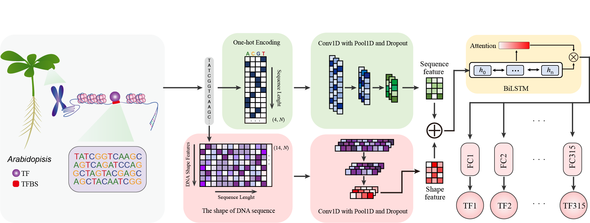

# PlantBind: An attention-based multi-label neural networks for predicting transcription factor binding sites in plants
##   Introduction
Identify of transcription factor binding sites (TFBSs) are essential for the analysis of gene regulation. Here, **PlantBind**, a method is presented for the integrated prediction and interpretation of TFBS events from DNA sequences and DNA shape profiles. Built upon an attention-based multi-label deep learning framework, PlantBind not only simultaneously predicts the binding sites of TFs. As shown in **Figure 1**, the hybrid model consists of data processing module, embedding module, feature extraction module, and multi-label output module.

<p align="center">

</p>  
<p align="center"><b>Figure: The model workflow</b></p>  

The model provides researchers with tools to:

1. Identify the TFBSs of transcription factors.
2. Identify DNA-binding motif of transcription factors

## Tutorials
These are a work in progress, so forgive incompleteness for the moment. If there's a task that you're interested in that I haven't included, feel free to post it as an Issue at the top.

## 1. Environment setup

#### 1.1 Create and activate a new virtual environment

Users have their own choice of how to install required packages. But to efficiently manage the installation packages, Anaconda is recommended. After installing Annocoda, it would also be an good option to use virtual environment in annocoda. `conda activate` can be used to activate a virtual environment, and then install required packages. If users want to exit the virtual environment, simply type `conda deactivate`. 

#### 1.2 Install the package and other requirements

Run command to install pytorch

```
python3 -m pip install --pre torch torchvision -f https://download.pytorch.org/whl/nightly/cu111/torch_nightly.html -U
```

Download and extract the source code for PlantBind and move to parent directory, type following commands:
```
unzip PlantBind.zip
```

#### 1.3 Software Requirements

**Software list**
- python      v3.8.12
- pytorch     v1.10.2
- numpy       v1.16.4
- pandas      v1.4.1
- sklearn     v1.0.2
- scipy       v1.5.3
- matplotlib  v3.5.1

## 2. Data information and processing
In this part, we will first introduce the **data information** used in this model, then introduce the training and predicting **data formats**, and finally introduce how to create a data set that meets the model requirements for prediction.  
All data can be downloaded from the data directory (PlantBind/data)(https://github.com/wenkaiyan-kevin/PlantBind/tree/main/data):
- **Ath-TF-peaks**: the TFBS peak info of 315 Ath TFs, and one neg.bed file
- **Maize-TF-peaks**: the TFBS peak info of 4 maize TFs for trans-species
- **model**: The file that holds the model, which can be loaded to predict new datasets

### 2.1 Construction of the dataset
Next, we will mainly introduce how to create the files mentioned above.
- [Data processing methods](docs/make-datasets.md)
  - [DNA Sequence Data](docs/make-datasets.md#DNA_Sequence_Data)
  - [DNA Shape Data](docs/make-datasets.md#DNA_Shape_Data)
  - [Data Label](docs/make-datasets.md#Data_Label)

#### 2.1.1 DNA Sequence Data
If you are trying to train PlantBind with your own data, please process your data into the same format as defined above. First of all you need to split your dataset into train, valid and test dataset  We also provide a custom python program `dna_shape.py`, `generate_sequence_file.py` in the parent directory for this conversion.

First of all preprocess your positive as well as negative FASTA files to split data into train, test and valid dataset. 
```
cat your_pos_fasta_file.fa | paste - -  | awk '{print $2}' > output_file_pos.txt  # For positive fasta file
cat your_neg_fasta_file.fa | paste - - | awk '{print $2}' > output_file_neg.txt  # For negative fasta file
```
Split both postive and negative data into train, test and valid dataset by running following customized python command:

```
python3 train_valid_test.py output_file_pos.txt output_file_neg.txt train_sequence.table valid_sequence.table test_sequence.table
```
#### 2.1.2 DNA Shape Data
Now all these convert these `.table` file to shape file also using following customized python program:
```
python3 dna_shape.py train # For train DNA data shape
python3 dna_shape.py test # For test DNA data shape
python3 dna_shape.py valid # For valid DNA data shape
```
**Output:**
The output files `train_DNA_shape.npyt`, `test_DNA_shape.npy`, and `valid_DNA_shape.npy`, label files are generated.
#### 2.1.3 Data Label
Generating the label matrix is divided into the following steps：  
(i)  Merge all TF peak files into one file  
(ii) Use the `bedtools annotate -i merge.bed -files ... -names ... > model-input-labels.txt` generate the label matrix.  
(iii)Generate binary matrix.
Use following customized python program:
```
python3 generate_binary_matrix.py train 
python3 generate_binary_matrix.py test
python3 generate_binary_matrix.py valid
```
**Output:**
The output files `train_label.txt`, `test_label.txt`, and `valid_label.txt`, label files are generated.

## 3. Model Training Based on attention-based multi-label neural networks
#### 3.1. Data formats for model training and testing

For training, the data mainly consists of three files: (1)DNA sequence file; (2)DNA shape file; (3)data label file  
For predicting, the data mainly consists of three files: (1)DNA sequence file; (2)DNA shape file  

- [Data Format Details Introduction](docs/data_format.md)
  - [DNA Sequence File](docs/data_format.md#DNA_Sequence_File)
  - [DNA Shape File](docs/data_format.md#DNA_Shape_File)
  - [Data Label File](docs/data_format.md#Data_Label_File)


#### 3.2 Training of the model 
 
**Input:** `train_sequence.table`,`train_DNA_shape.npy`,`train_label.txt`.  
All data files need to be placed in the same folder before starting training, such as `data_folder` 

```
python3 -m torch.distributed.launch --nproc_per_node=2 src/main.py --inputs example/ --length 101 --OHEM True --focal_loss True --batch_size 1024 --lr 0.01
```
**Output:** 
**Model** The resulting model file (`trained_model_101_seqs.pkl`) will be saved to `output/` directory.

#### 3.3 Testing of the model 
**Input:** `test_sequence.table`,`test_DNA_shape.npy`,`test_label.txt`.   
All data files need to be placed in the same folder before starting testing, such as `data_folder` 

```
python main.py --inputs example/ --length 101 --mode test
```
**Output:** The output files,`metrics_b.json`,`metrics_m.json`,`Gmean_threshold_b.txt`,`Gmean_threshold_m.txt`,`precision_recall_curve_TFs_315.pdf`,`roc_prc_curve_TFs_315.pdf` will be saved to `output/` directory. In these output files, `metrics_m.json` file contains the information about the evaluation metrics for the test dataset calculated by using multi-label trained model per epoch and  `metrics_b.json` file contains the information about the evaluation metrics for the test dataset calculated by using binary-label trained model.

## 5. Use the pre-trained model to predict new data

**Input:** `sequence.table`,`DNA_shape.npy`  
The analysis is done by using the [src/inference.py] script and modifying the relevant parameters.

**Output:** After training the model,result of the test dataset containing accuracy will be saved at `output/` directory.

## Citation
If you use PlantBind in your research, please cite the following paper:</br>
[PlantBind: an attention-based multi-label neural network for predicting plant transcription factor binding sites](https://academic.oup.com/bib/article/23/6/bbac425/6713513)",<br/>
Briefings in Bioinformatics 23, no. 6 (2022): bbac425.
