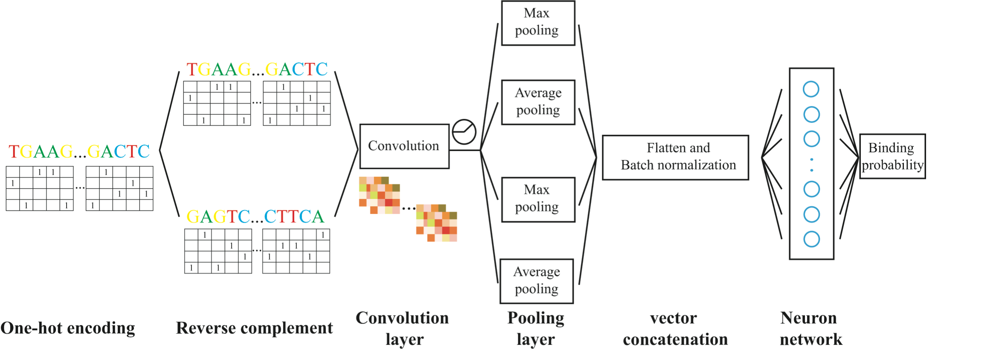

# SeqConv
## Introduction
The goal of this model is to predict the binding probability of a specific transcription factor based only on DNA sequence information of the binding region by means of convolutional neural network. 
The architecture of the model and the calibration phase steps are explained in this **Figure** from the paper:


## 1. Environment setup

#### 1.1 Create and activate a new virtual environment

Users have the flexibility to choose how they install the necessary packages. However, for efficient package management, we recommend using Anaconda. Once Anaconda is installed, creating and utilizing a virtual environment within Anaconda is a wise option. You can activate a virtual environment with `conda activate` and proceed to install the required packages. If you wish to exit the virtual environment, simply type `conda deactivate`. 

#### 1.2 Install the package and other requirements

**Software list**

- tensorflow or Theano   
- keras  
- sklearn  
- numpy  
- matplotlib  
- tqdm  

To extract the source code for SeqConv, execute the following commands:

```
unzip SeqConv.zip
```
    
**R package:**

- To install motifStack:

ENTER R and execute the following commands:  

```
R
 
if (!require("BiocManager", quietly = TRUE))
   install.packages("BiocManager")

BiocManager::install("motifStack")
quit()

```

## 2. Data information

#### 2.1 Data processing

In this part, we will first introduce the **data information** used in this model, then describe the training **data formats**, and finally introduce how to create a data set that meets the model requirements.

We have included an example data format that is compatible with the SeqConv input data format (refer to `example/ABF2_train.txt`). If you intend to train SeqConv with your own data, please ensure that your data is processed into the same format.

#### 2.2 Generating train and test dataset on your own datasets using following commands

To generate your own positive dataset using a **BED file**, you only need to provide a TF peak file, `example/ABF2_pos.bed`, and a genome file in **FASTA format**, which should be located in the `example/` directory. In this demonstration, a peak file from *Arabidopsis thaliana* DAP-seq data is used. Ensure that the BED file is sorted by using the `sort` command in the terminal (e.g., 'sort -k1,1 -k2,2n in.bed > in.sorted.bed' for BED files). Then, run the following command:

```
cd example/
wget https://ftp.ensemblgenomes.ebi.ac.uk/pub/plants/release-57/fasta/arabidopsis_thaliana/dna/Arabidopsis_thaliana.TAIR10.dna.toplevel.fa.gz
gzip -d Arabidopsis_thaliana.TAIR10.dna.toplevel.fa.gz
cat Arabidopsis_thaliana.TAIR10.dna.toplevel.fa | cut -d" " -f1 | sed "s/>/>chr/g" | awk '/^>/ {printf("\n%s\n",$0);next;}{printf("%s",$0);} END {printf("\n");}' | grep -A1 ">chr[0-9]" >  GCF_000001735.4_TAIR10.1_genomic-1.fna
cd ../
python3 src/prepare.py example/ABF2_pos.bed example/GCF_000001735.4_TAIR10.1_genomic-1.fna ABF2_pos.txt
```
For generating negative data, run the following command:
```
python3 src/generator.py example/ABF2_pos.bed
```
To split both the positive and negative data into training and testing datasets, you can use this customized Python script:
```
python3 src/train_test.py example/ABF2_pos.txt example/ABF2_neg.txt ABF2_train.txt ABF2_test.txt
```
**Output:**

The Python program `prepare.py` will generate a positive `ABF2_pos.txt` file from the BED file and save it in the `example/` directory. On the other hand, `generator.py` will create a negative `ABF2_neg.txt` file. This file consists of two columns separated by a tab delimiter. The first column contains labels (1 for positive sequences and 0 for negative sequences), while the second column contains the DNA strings.

After generating these files, the next step is to split both the positive and negative sequences into training and testing datasets. You can do this to prepare for training and evaluating the SeqConv model using the `src/SeqConv.py` program.

## 3. Model Training Based on Convolutional Neural Network (CNN)

#### 3.1 Training SeqConv on plant TF datasets
**Input:** `ABF2_train.txt`, `ABF2_test.txt` .
All data files should be in the same folder before training, such as in the `example/` directory.

**Usage:**
Run the following command in the parent directory:

``` 
python3 src/SeqConv.py ABF2 
```
**Output:**

**Final result:** 

The resulting model files, named `ABF2_model.h5`, will be saved in the `output/` directory. After training the model, the results of the test dataset, including accuracy and other metrics (such as the confusion matrix), will be saved in a file named `ABF2_result.txt` located in the `output/` directory.


#### 3.3 Motif Visualization
- For visualizing the the motif predicted by SeqConv, run the following command:
``` 
python3 src/motifGen.py ABF2
Rscript src/plot_motif.r ABF2
```
**Output:**
Two files, namely `ABF2_seq.meme` and `ABF2_motif.pdf`, are generated and saved in the `output/` directory.

After training, there will be images showing the loss error and val_loss error during the training step, as well as the ROC curve showing the precision of the trained model. Additional steps are required to extract and plot the binding motif from convolution layer. And the trained model can be easily transfered to predict TFBS in other plants with high accuracy.


## Citation

If you use SeqConv in your research, please cite the following paper:</br>
"[Deep learning-based prediction of TFBSs in plants](https://www.cell.com/trends/plant-science/fulltext/S1360-1385(21)00158-8)", Technology of the Month 26, no. 12 (2021): 1301-1302.<br/>
