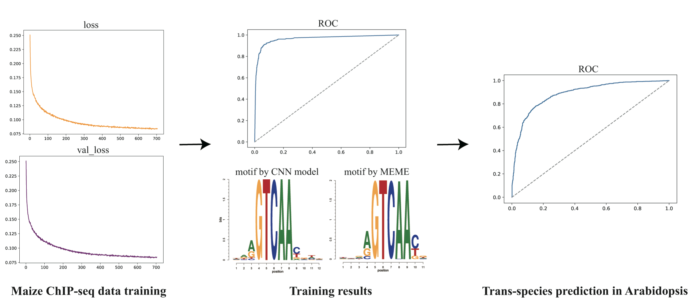

# SeqConv
## Introduction
The goal of this model is to predict the binding probability of a specific transcription factor based only on DNA sequence information of the binding region by means of convolutional neural network. 
The architecture of the model and the calibration phase steps are explained in this **Figure 1** from the paper:


## 1. Environment setup

#### 1.1 Create and activate a new virtual environment

Users have their own choice of how to install required packages. But to efficiently manage the installation packages, Anaconda is recommended. After installing Annocoda, it would also be an good option to use virtual environment in annocoda. `conda activate` can be used to activate a virtual environment, and then install required packages. If users want to exit the virtual environment, simply type `conda deactivate`. 

#### 1.2 Install the package and other requirements

Download and extract the source code and move to parent directory, type:

```
unzip SeqConv.zip
```
#### 1.3 Software Requirements

**Software list**

- tensorflow or Theano   
- keras  
- sklearn  
- numpy  
- matplotlib  
- tqdm  
    
**R package:**

- To install motifStack:

ENTER R and type following commands:  

```
R
 
if (!require("BiocManager", quietly = TRUE))
   install.packages("BiocManager")

BiocManager::install("motifStack")
quit()

```

## 2. Data information

#### 2.1 Data processing

In this part, we will first introduce the **data information** used in this model, then introduce the training **data formats**, and finally introduce how to create a data set that meets the model requirements.

We have provided example data format compatible with SeqConv input data format (See `example/ABF2_train.txt`). If you are trying to train SeqConv with your own data, please process your data into the same format as it.

## 3. Model Training Based on Convolutional Neural Network (CNN)

#### 3.1 Training SeqConv on plant TF datasets
**Input:** `ABF2_train.txt`, `ABF2_test.txt` .
All data files need to be placed in the same folder before training, such as `example/`.

**Usage:**
Run the following command in parent directory:

``` 
python3 src/SeqConv.py ABF2 
```
**Output:**

**Final result** The resulting model files `ABF2_model.h5` will be saved to `output/` directory.

After training the model, result of the test dataset containing accuracy and others metrics (including confusion matrix) will be saved to `ABF2_result.txt` located at `output/` directory.

#### 3.2 Generating train and test dataset on your own datasets using following commands

For generating your own positive dataset using **bed file**, one only needs to provide a TF peak file `example/ABF2_pos.bed` and genome file in **FASTA format** at location `example/`. In this demo, a peak file from *Arabidopsis thaliana* DAP-seq data is used. The bed file should be in sorted order using sorted command the terminal (e.g., sort -k1,1 -k2,2n in.bed > in.sorted.bed for BED files).

For generating positive data, you would need TFBS bed file and species-specific genome. Therefore download the genome file in the `example/` directory. Thus, run following command:
```
cd example/
wget https://ftp.ncbi.nlm.nih.gov/genomes/refseq/plant/Arabidopsis_thaliana/all_assembly_versions/GCF_000001735.4_TAIR10.1/GCF_000001735.4_TAIR10.1_genomic.fna.gz
cd ../
python3 src/prepare.py example/ABF2_pos.bed GCF_000001735.4_TAIR10.1_genomic-1-.fna ABF2_pos_neg_train.txt
```
For generating negative data, run following command:
```
python3 src/generator.py example/ABF2_pos.bed
```
**Output:**
Python program `prepare.py` will generate a positive `ABF2_pos.txt` file from bed file and saved to `example/` directory. While, `generator.py` will generate a negative `ABF2_neg.txt` file. This file contains two columns separated by tab delimiter: first columns have label(1 for positive sequences and 0 for negative sequences) and second columns is the dna string. After that you have to split both positive and negative sequences in train and test files to train and evaluate the SeqConv model using `src/SeqConv.py` program.

#### 3.3 Motif Visualization
- For visualizing the the motif predicted by SeqConv, run following command:
``` 
python3 src/motifGen.py ABF2
Rscript src/plot_motif.r ABF2
```
**Output:**
The two files are generated namely `ABF2_seq.meme` and `ABF2_motif.pdf` and saved to `output/` directory.

After training, there will be images showing the loss error and val_loss error during the training step, as well as the ROC curve showing the precision of the trained model. Additional steps are required to extract and plot the binding motif from convolution layer. And the trained model can be easily transfered to predict TFBS in other plants with high accuracy.



## Citation

If you use SeqConv in your research, please cite the following paper:</br>
"[Deep learning-based prediction of TFBSs in plants](https://www.cell.com/trends/plant-science/fulltext/S1360-1385(21)00158-8)",
Technology of the Month 26, no. 12 (2021): 1301-1302.<br/>
