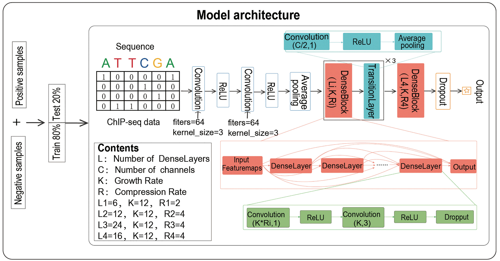

# TSPTFBS-2.0
TSPTFBS 2.0 is a [webserver](http://www.hzau-hulab.com/TSPTFBS/) based on deep learning models for transcription factor binding site (TFBS) prediction. It can be used to mine the potential core motifs within a given sequence by the trained 389 TFBS prediction models of three species (Zea mays, Arabidopsis, Oryza sativa) and the three interpretability algorithms Deeplift, *in-silico* tiling-deletion and *in-silico* mutagenesis. [TSPTFBS 2.0](https://github.com/liulifenyf/TSPTFBS-2.0) is freely accessible for all users. 

<p align="center">

</p>
<p align="center"><b>Figure: The model workflow</b></p> 

## 1. Environment setup 

#### 1.1 Create and activate a new virtual environment

Users have the flexibility to choose how they install the necessary packages. However, for efficient package management, we recommend using Anaconda. Once Anaconda is installed, creating and utilizing a virtual environment within Anaconda is a wise option. You can activate a virtual environment with `conda activate` and proceed to install the required packages. If you wish to exit the virtual environment, simply type `conda deactivate`.

#### 1.2 Install the package and other requirements

Run following command to install pytorch:

```
python3 -m pip install --pre torch torchvision -f https://download.pytorch.org/whl/nightly/cu111/torch_nightly.html -U
```

The program requires:
  * python==3.7.13
  * tensorflow-gpu==2.0.0 (for model training)
  * tensorfow==1.14.0 (for DeepLIFT, TF-MoDISco and model predicting)
  * deeplift
  * modisco
  * keras==2.3.1.0.2
  * scikit-learn==1.0.2
  * pandas 
  * numpy 
  * the [bedtools](https://bedtools.readthedocs.io/en/latest/) software
To extract the source code for LS-GKM, execute the following commands:

```
unzip TSPTFBS-2.0.zip
```

## 2. Data information

#### 2.1 Data processing

In this part, we will first introduce the **data information** used in this model, then introduce the training **data formats**, and finally introduce how to create a data set that meets the model requirements.

We have included an example data format that is compatible with TSPTFBS-2.0's input data format (refer to `example/ABF2_pos.fa`).

Please review the example input files **ABF2_pos.fa** & **ABF2_neg.fa** located in the `example/` directory. If you intend to train TSPTFBS-2.0 with your own data, ensure that your data is prepared in the same format as the provided examples.

## 3. Model Training Based on DenseNet

#### 3.1 Training TSPTFBS-2.0 on plant TF datasets
**Input:** `ABF2_pos_train.fa`,`ABF2_neg_train.fa`. 
All data files need to be placed in the same folder before training.

**Note*:* Both the input files should be in the **FASTA** format.

- **Usage:**
Run the following command in the parent directory:

```
python3 densenet.py example/ABF2/ABF2
```
**Output:** 

**Final model:** 

The final trained model, will be saved in the output location `example/ABF2/` as `checkmodel.hdf5` text file. Additionally, separate text files, named `ABF2_performance_metrices` and `ABF2_result.txt`, will also be saved in the `example/ABF2` directory. These text files contain the performance metrics for the test dataset.


## 4. Interpretability

```
cd TSPTFBS-2.0
python3 interpretability.py <input fasta file> <species> <tf>
```
It should be noted ```<species>``` that one is chosen from 'Zea_mays_models','Arabidopsis_models' and 'Oryza_sativa_models'.
It should be noted ```<tf>``` that one is chosen from the tf names of selected species.
After running the program, a dir about deeplift results will be generated in the current folder.
We here provide a test.fa file and employed one of models of Zea mays for an example: 
```
python interpretability.py Example/test.fa Zea_mays_models ALF2 
```
## 5. TF-MoDISco
```
cd TSPTFBS-2.0
python3 modisco_test.py <input fasta file> <species> <tf>
```
It should be noted ```<species>``` that one is chosen from 'Zea_mays_models','Arabidopsis_models' and 'Oryza_sativa_models'.
It should be noted``` <tf>``` that one is chosen from the tf names of selected species.
After running the program, a dir about tf-modisco results will be generated in the current folder.
We here provide a test.fa file and employed one of models of Zea mays for an example: 
```
python3 modisco_test.py Example/test.fa Zea_mays_models ALF2 
```
## Citation
* Huang, G., et al. Densely Connected Convolutional Networks. IEEE Computer Society 2016.
* Shrikumar, A., Greenside, P. and Kundaje, A. Learning Important Features Through Propagating Activation Differences. 2017.
* Shrikumar, A., et al. Technical Note on Transcription Factor Motif Discovery from Importance Scores (TF-MoDISco) version 0.5.6.5. In.; 2018. p. arXiv:1811.00416.
