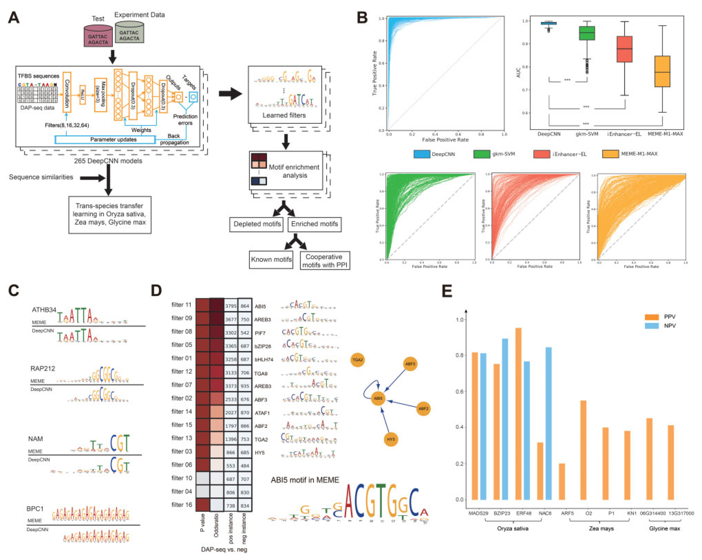

# TSPTFBS
## Introduction
The architecture of the model and the calibration phase steps are explained in this **Figure 1** from the paper:

<p align="center">

</p>
<p align="center"><b>Figure: The model workflow</b></p>


## 1. Environment setup

We recommend that you use [conda](https://docs.conda.io/en/latest/) to install all of the following software.

#### 1.1 Create and activate a new virtual environment

```
conda activate
```

#### 1.2 Software Requirements
***software list***

The program requires:
  * python >=3.6
  * tensorflow 2.0.0
  * keras 2.3.1
  * pandas
  * numpy
  * scikit-learn
  * TAIR10 reference genome
  * the [bedtools](https://bedtools.readthedocs.io/en/latest/) software

#### 1.3 Install the package and other requirements

Download and extract the source code for TSPTFBS and move to parent directory, type following commands:

```
unzip TSPTFBS.zip
cd TSPTFBS
```
## Tutorial
## 2. Data information

#### 2.1 Data processing

In this part, we will first introduce the **data information** used in this model, then introduce the training **data formats**, and finally introduce how to create a data set that meets the model requirements.

We have provided example data format compatible with TSPTFBS input data format (See `example/ABF2_train.txt`).

Please see the example input files **ABF2_pos_train.fa & ABF2_neg_train.fa** at `example/`. If you are trying to train TSPTFBS with your own data, please process your data into the same format as it.


#### 2.2 Model Training Based on Convolutional Neural Network (CNN)
- **Training** 
**Input:** `ABF2_pos_train.fa`,`ABF2_neg_train.fa`. 
All data files need to be placed in the same folder before training, such as `example/train`.

**Note that** both the input files should be in the **FASTA** format.

- **Input File Format**
The input file must contain DNA sequences which have a length of 201bp with a FASTA format. A FASTA file of the example is:

```
>ID
ACGAACAGATAAAAATCACAGAGAGTACTAAAACCCTAAGGTGGGGTTAGAGGTAGACGAAACAATGAAACGGAATCGTTTTAGTACGAGAAACTGCCACGTGGCATTATCTTGCACGTGTCAGTGGCTTTAGAGTTAAATACACATTTTCTGAAAATGATTTTCAACATCTGAAGAAAAGAATCTAGACGACGACAATGG
>ID
AGTTCGCATGGTTTACGGAGATGGAGACAACATCTTCGACGATTCTTGAGAGCCCGATTTTCTCGTCGGAGAAAAAGACGGCTGTCTCGGGGGCTGATGACGTGGCGGTGTTCTTTCCGATGGGAGAAGAGGATGAGTCTTTGTTCGCCGATCTCGGCGAGTTGCCGGAGTGTTCTGTGGTGTTTCGTCACCGGAGTAGCG
```

- **Usage:**
Run following command in the parent directory:

```
python3 Train.py ABF2
```
- **Output:** 

 - **Final model** 

The final six trained models on different filter_length range from 11-22 will be saved to output location `output/ABF2/model/` with `ABF2_pos_train-model-filter_length.hdf5` text files and six different text files `ABF2_pos_train-result-filter_length.txt` on the basis their different filter_length will be saved at `output/ABF2/result/` directory that have the performance metrics on test dataset.

- **Prediction of test dataset**
  
- **Input File Format**

Here we provide `ABF2_label.txt` and `ABF2_test.fa` files in the `example/` directory to predict the test sequences using the pre-trained model: 
To get the performance metrics for the test dataset on different filter_length using pre-trained model, run the following command: 
```
python3 Predict.py ABF2
```
 - **Output:**

Prediction result having accuracy and others metrics (including confusion matrix) on test dataset using various `filter_length` will also be saved to `ABF2_result.txt` located at `output/` directory.

## Citation

If you use TSPTFBS in your research, please cite the following paper:</br>
"[TSPTFBS: a Docker image for trans-species prediction of transcription factor binding sites in plants](https://academic.oup.com/bioinformatics/article/37/2/260/6069568)",<br/>
Bioinformatics 37, no. 2 (2021): 260–262.
