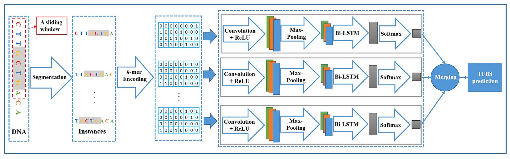

# WSCNNLSTM
## Introduction
Modeling *in-vivo* protein-DNA binding by combining multiple-instance learning with a hybrid deep neural netwok.

The architecture of the model and the calibration phase steps are explained in this **Figure** from the paper:

<p align="center">

</p>
<p align="center"><b/>Figure: The model workflow</b></p>

## 1. Environment setup

#### 1.1 Create and activate a new virtual environment

Users have their own choice of how to install required packages. But to efficiently manage the installation packages, Anaconda is recommended. After installing Annocoda, it would also be an good option to use virtual environment in annocoda. `conda activate` can be used to activate a virtual environment, and then install required packages. If users want to exit the virtual environment, simply type `conda deactivate`. 

#### 1.2 Install the package and other requirements


**Software list**
- python >=3.6
- pytorch
- numpy 
- pandas
- sklearn
- scipy 
- matplotlib

To extract the source code for WSCNNLSTM, execute the following commands:

```
unzip WSCNNLSTM.zip
```
## 2. Data information

#### 2.1 Data processing
In this part, we will first introduce the **data information** used in this model, then describe the training **data formats**, and finally introduce how to create a data set that meets the model requirements.

Please refer to the example input files **ABF2_positive.fa** & **ABF2_negative.fa** in the `example/` directory. If you intend to train WSCNNLSTM with your own data, make sure to format your data in the same way.

**Note:** Both input files should be in the FASTA format

All data files should be in the same folder before training, like in the `example/` directory.

#### 2.2 Convert input FASTA sequences into *k*-mer encoding
**Usage:**

Execute the following command in the parent directory to perform *k*-mer encoding for both positive and negative sequences.

```
python3 encoding.py posfile negfile outfile -m mapperfile -c instance_len -s instance_stride --no-reverse -kmer kmer -run 'run'

Passing arguments:

    "posfile",  type=str, help="Positive sequences in FASTA/TSV format (with .fa/.fasta or .tsv extension)")
    "negfile",  type=str,help="Negative sequences in FASTA/TSV format")
    "outfile",  type=str, help="Output file (example: $MODEL_TOPDIR$/output/train.hdf5). ")
    "-m", "--mapperfile", dest="mapperfile", default="", help="A file mapping each nucleotide to a vector.")
    "-l", "--labelname", dest="labelname",default='label', help="The group name for labels in the HDF5 file")
    "-d", "--dataname", dest="dataname",default='data', help="The group name for data in the HDF5 file")
    "-c", "--instance_len", dest="instance_len", type=int, default=100, help="The length of instance")
    "-s", "--instance_stride", dest="instance_stride", type=int, default=20, help="The stride of getting instance")
    "-kernel", "--kernelsize", dest="kernelsize", type=int, default=24, help="The stride of getting instance")
    '--reverse', dest='reverse', action='store_true', help='build the reverse complement.')
    '--no-reverse', dest='reverse', action='store_false', help='not to build the reverse complement.')
    "-kmer", "--kmer", dest="kmer", type=int, default=1, help="the length of kmer")
    "-run", "--run", dest="run", type=str, default='ws', help="order")
```
For example, run the following command for the 3 *k*-mer:
- **Input:** `ABF2_positive.fa`,`ABF2_negative.fa` in `example/` directory. 

```
python3 encoding.py ./example/ABF2_positive.fa ./example/ABF2_negative.fa ./output/ABF2_datalabel.hdf5 -m ./mappers/3mer.txt -c 120 -s 10 --no-reverse -kmer 3 -run 'ws'
```
**Output:** 
The output file (`ABF2_datalabel.hdf5`) containing specific *k*-mer encoding data is saved in the `output/` directory.

## 3. Model Training Based on Multi-instance learning and hybrid neural network

#### 3.1 Training and evaluation of the WSCNNLSTM model


**Input:** The output file `datalabel.hdf5` from the specific *k*-mer encoding serves as the input file for model training. 

**Usage:**
In the parent directory, execute the following command for model training and the calculation of evaluation metrics on the test dataset:

```
python3 train_val_test.py -datalable datalable -k kmer -run 'run' -batchsize batchsize -params params

    '-datalable', dest='datalable', type=str, help='Positive data for training, testing')
    '-k', dest='k_folds', type=int, default=3, help='k-folds cross-validation')
    '-kernelsize', dest='kernelsize', type=int, default=24, help='the kernel size of convolutional layer')
    '-batchsize', dest='batchsize', type=int, default=300, help='the size of one batch')
    '-ratio', dest='ratio', type=float, default=0.125, help='the propotion of validation data over the training data')
    '-params', dest='params', type=int, default=1, help='the number of paramter settings')
    '-train', dest='train', action='store_true', default=True, help='only test step')
    '-plot', dest='plot', action='store_true', default=True, help='only test step')
    '-run', dest='run', type=str, default='nows', help='three encoding methods, including ws, nows')
```
For example, run the following command to train the model on the training dataset and test it on the test dataset
    
```
python3 train_val_test.py -datalable ./output/ABF2_datalabel.hdf5 -k 3 -run 'ws' -batchsize 300 -params 12
```
**Output:** 

**Final result:** 

All the trained models from *k*-fold cross-validation, labeled as    `params0_bestmodel_(fold_number)fold.hdf5`, and prediction scores (named `score_(fold_number)fold.txt`) from *k*-fold cross-validation are stored in the `output/` directory.

The performance metrics for the test dataset are saved in the `result.txt` file, also located in the `output/` directory.


## Citation

If you use WSCNNLSTM in your research, please cite the following paper:</br>
"[Modeling in-vivo protein-DNA binding by combining multiple-instance learning with a hybrid deep neural network](https://www.nature.com/articles/s41598-019-44966-x)",<br/>
Scientific Reports 9, Article number: 8484 (2019).
