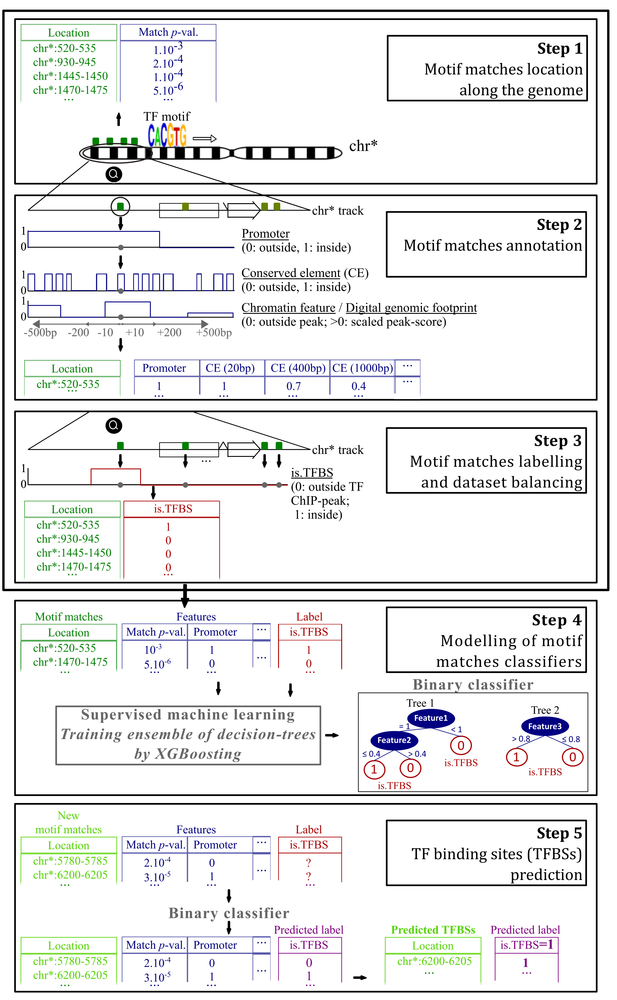

# Wimtrap
## Introduction
Wimtrap: Integrative tools to predict the location of transcription factor binding sites.

<p align="center">

</p>
<p align="center"><b>Figure: The model workflow</b></p>

## 1. Installation

#### 1.1 Install the package and other requirements

Download and extract the source code for Wimtrap and move to parent directory, type following commands:

```
unzip Wimtrap.zip
cd Wimtrap
```
Wimtrap is an R package that requires the last version of R (R 4.0.4), BiocManager and remotes to be installed. 

*Important: the installation of Wimtrap might take up to 1h if all the packages on which it depends need also to be installed.*

In R, type the following lines:
```
if(!require("remotes", quietly = TRUE)){  
    install.packages("remotes")
    }
if(!require("BiocManager", quietly = TRUE)){  
    install.packages("BiocManager")
    }
```
  
Then, you can enter:
```
options(repos = BiocManager::repositories())
getOption("repos")
BiocManager::install("RiviereQuentin/Wimtrap",                     
  dependencies = TRUE,                     
  build_vignettes = TRUE,
  force = TRUE)
quit()    
```

If an error occurs, it might be because the version of R, BiocManager and/or remotes is not updated. 

On linux, it might be also necessary to install as a prerequisite some software. This might be achieved by entering the following in the terminal:

```
sudo apt install libcurl4-gnutls-dev icu-devtools libicu-dev libxml2-dev bzip2-doc libbz2-dev liblzma-dev
```

## Tutorial
## 2. Data information

#### 2.1 Data processing

In this part, we will first introduce the **data information** used in this model, then introduce the training **data formats**, and finally introduce how to create a data set that meets the model requirements.

We have provided example data format compatible with Wimtrap input data format (See `example/`).

Please see the example input files **ABF2_pos_train.fa & ABF2_neg_train.fa** at `example/`. If you are trying to train Wimtrap with your own data, please process your data into the same format as it.


#### 2.2 Model Training Based on XGBoost

#### Build and apply a TF-specific model (for example: ABF2)

Predictions can be made taking into consideration chromatin state features related to different conditions (for ***Arabidopsis***: whole seedlings, seedling roots, non-hair part of seedling roots, flowers in stages 4-5, seed coats, heat-shocked seedlings, dark-grown seedlings, dark-grown seedlings exposed to 30min or 3h of light and dark-grown seedlings exposed to a long-day cycle; for the ***Solanum***: immature and ripening fruits).
To build and apply a TF-specific model, some functions are defined in this R package. Then, to predict the binding sites of "ABF2" of Arabidopsis, type:

```
R
library(Wimtrap)

#The file paths to the genomic data, encoded in BED or GTF/GFF files, are input through the `genomic_data` argument.
#Each file is named according to the feature that it allows to define.
#Remark: the chromosomes are named, in the chrom field of the BED files, according to their number. 
#This number might be preceded by the prefix 'chr' (case-insensitive). For chromosome 1,  'chr1', 'CHR1', 'Chr1' 
#or '1' are accepted.
#Remark: the regions described by a file are all assigned to a score of '1' if the score field is empty (cf. CNS).
# As for the genomic intervals that are not included in a file, they are all assigned to a null score.


args <- commandArgs(trailingOnly = TRUE)
imported_genomic_data.seedlings <- importGenomicData(organism = "Arabidopsis thaliana",
                                                      genomic_data = c(
                                                       DHS = "example/DHS_athal_seedlings_normal.bed",
                                                       DGF = "example/DGF_athal_seedlings_7_days.bed",
                                                       CNS = "example/CNS_athal.bed"
                                                  ))


#The motif representing is encoded in a file in raw pfm format. Other formats are also allowed:
#meme, jaspar, transfac, homer and cis-bp.

#You must specify the name of the transcription factor (here ABF2) as it appears in the file giving
#the motif throught the `TFnames` argument.

#The genome sequence of the considered organism(s) might be automatically downloaded if you provide
#their names through the `organism` argument.
#If you provide the genome sequence from a FASTA file, make sure that the chromosomes are named according to their number. 
#This number might be preceded by the prefix 'chr' (case-insensitive). For chromosome 1,  'chr1', 'CHR1', 'Chr1' 
#or '1' are accepted.


ABF2data.seedlings <- getTFBSdata(pfm = "example/PFMs_athal.pfm",
                               TFnames = "ABF2",
                               organism = "Arabidopsis thaliana",genome_sequence = "example/GCF_000001735.4_TAIR10.1_genomic-1-.fna",
                               imported_genomic_data = imported_genomic_data.seedlings)

# Name the `ChIPpeaks` argument according to the training transcription factor(s)

ABF2model <- buildTFBSmodel(ABF2data.seedlings, 
                             ChIPpeaks = c(ABF2 = example/ABF2.bed),
                             
                             model_assessment = TRUE)                                
```

- **Description of the functions used to build and evaluate a model**
1. importGenomicData() to import the genomic data for the interested species (for example: genomic data for seedlings of Arabidopsis).
2. getTFBSdata() to build the dataset of potential binding sites of specific TF (for example: ABF2) for Arabidopsis thaliana.
3. buildTFBSmodel to get the predictive classifier and, optionally, evaluate the model.
	
- **Output** 

After the model evaluation, three type of output will be generated for test dataset:
1. Plot of ROC curve will be saved in the current running directory in `Rplots.pdf` file.  
2. Plot the feature importance, in terms of gain will be saved in the current running directory in `Rplots.pdf` file.
3. Print on the screen the confusion matrix obtained using a prediction score threshold of 0.5, that gives the FP, FN, TP and TN associated to the classification of the potential binding sites of the balanced ‘validation’ dataset by the model.
	
## Citation

If you use Wimtrap in your research, please cite the following paper:
"[Exploiting Genomic Features to Improve the Prediction of Transcription Factor-Binding Sites in Plants](https://academic.oup.com/pcp/article/63/10/1457/6633738?login=true)",<br/>
Plant and Cell Physiology 63, no. 10 (2022): 1457–1473.
