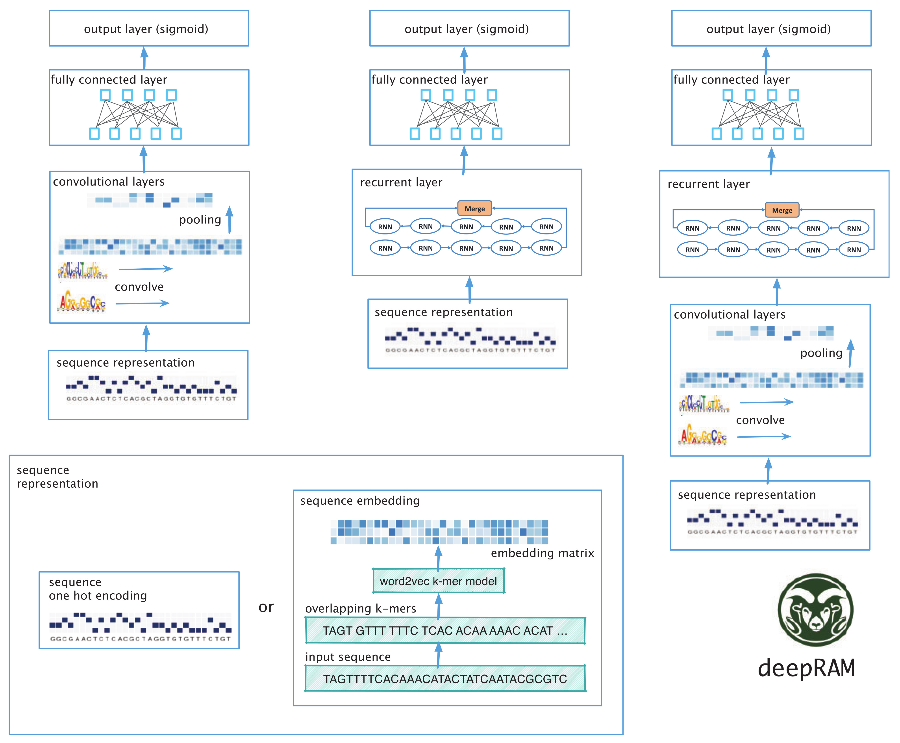

# deepRAM
## Introduction
deepRAM is an end-to-end deep learning toolkit for predicting protein binding sites and motifs. It helps users run experiments using many state-of-the-art deep learning methods and addresses the challenge of selecting model parameters in deep learning models using a fully automatic model selection strategy. This helps avoid hand-tuning and thus removes any bias in running experiments, making it user friendly without losing its flexibility.

deepRAM allows users the flexibility to choose a deep learning model by selecting its different components: input sequence representation (one-hot or k-mer embedding), whether to use a CNN and how many layers, and whether to use an RNN, and the number of layers and their type. For CNNs, the user can choose to use dilated convolution as well.

<p align="center">

</p>
<p align="center"><b/>Figure: The model workflow</b>b></p>

## 1. Environment setup

#### 1.1 Create and activate a new virtual environment

Users have the flexibility to choose how they install the necessary packages. However, for efficient package management, we recommend using Anaconda. Once Anaconda is installed, creating and utilizing a virtual environment within Anaconda is a wise option. You can activate a virtual environment with `conda activate` and proceed to install the required packages. If you wish to exit the virtual environment, simply type `conda deactivate`. 

#### 1.2 Install the package and other requirements


-  <a href=https://www.python.org/downloads/source/>Python 3.6 </a> <br>
-  <a href=https://pytorch.org/>PyTorch 1.0 library </a> (Deep learning library) <br>
-  <a href=https://github.com/scikit-learn/scikit-learn>sklearn</a> (Machine learning library)<br>
-  <a href=https://anaconda.org/anaconda/gensim>gensim</a> (library used to train word2vec algorithm) <br>
-  <a href=https://anaconda.org/anaconda/numpy>numpy</a> <br>

To extract the source code for deepRAM, execute the following commands:

```
unzip deepRAM.zip
pip3 install -r Prerequisites
python3 setup.py install
```

## 2. Data information

#### 2.1 Data processing
In this part, we will first introduce the **data information** used in this model, then introduce the training **data formats**, and finally introduce how to create a data set that meets the model requirements.

We have provided an example data format that is compatible with the deepRAM input data format (deepRAM input data format: See `example/ABF2_train.txt`. If you intend to train deepRAM with your own data, make sure to format your data in the same way as the example input data provided above.


## 3. Model Training Based on Convolutional Neural Network (CNN)
#### 3.1 Training and testing  
**Input:** `ABF2_train.txt`,`ABF2_test.txt`. 

Before training, ensure that all data input files are placed in the same folder, such as in the `example/` directory.

**Usage:**
Run the following command in parent directory:

```
usage: deepRAM.py [-h] [--train_data TRAIN_DATA] [--test_data TEST_DATA]
                  [--data_type DATA_TYPE] [--train TRAIN]
                  [--predict_only PREDICT_ONLY]
                  [--evaluate_performance EVALUATE_PERFORMANCE]
                  [--models_dir MODELS_DIR] [--model_path MODEL_PATH]
                  [--motif MOTIF] [--motif_dir MOTIF_DIR]
                  [--tomtom_dir TOMTOM_DIR] [--out_file OUT_FILE]
                  [--Embedding EMBEDDING] [--Conv CONV] [--RNN RNN]
                  [--RNN_type RNN_TYPE] [--kmer_len KMER_LEN]
                  [--stride STRIDE] [--word2vec_train WORD2VEC_TRAIN]
                  [--word2vec_model WORD2VEC_MODEL]
                  [--conv_layers CONV_LAYERS] [--dilation DILATION]
                  [--RNN_layers RNN_LAYERS]

sequence specificities prediction using deep learning approach

optional arguments:
  -h, --help            show this help message and exit
  --train_data TRAIN_DATA
                        path for training data with format: sequence label
  --test_data TEST_DATA
                        path for test data containing test sequences with or
                        without label
  --data_type DATA_TYPE
                        type of data: DNA or RNA. default: DNA
  --train TRAIN         use this option for automatic calibration, training
                        model using train_data and predict labels for
                        test_data. default: True
  --predict_only PREDICT_ONLY
                        use this option to load pretrained model (found in
                        model_path) and use it to predict test sequences
                        (train will be set to False). default: False
  --evaluate_performance EVALUATE_PERFORMANCE
                        use this option to calculate AUC on test_data. If
                        True, test_data should be format: sequence label.
                        default: False
  --models_dir MODELS_DIR
                        The directory to save the trained models for future
                        prediction including best hyperparameters and
                        embedding model. default: models/
  --model_path MODEL_PATH
                        If train is set to True, This path will be used to
                        save your best model. If train is set to False, this
                        path should have the model that you want to use for
                        prediction. default: BestModel.pkl
  --motif MOTIF         use this option to generate motif logos. default:
                        False
  --motif_dir MOTIF_DIR
                        directory to save motifs logos. default: motifs
  --tomtom_dir TOMTOM_DIR
                        directory of TOMTOM, i.e:meme-5.0.3/src/tomtom
  --out_file OUT_FILE   The output file used to store the prediction
                        probability of testing data
  --Embedding EMBEDDING
                        Use embedding layer: True or False. default: False
  --Conv CONV           Use conv layer: True or False. default: True
  --RNN RNN             Use RNN layer: True or False. default: False
  --RNN_type RNN_TYPE   RNN type: LSTM or GRU or BiLSTM or BiGRU. default:
                        BiLSTM
  --kmer_len KMER_LEN   length of kmer used for embedding layer, default= 3
  --stride STRIDE       stride used for embedding layer, default= 1
  --word2vec_train WORD2VEC_TRAIN
                        set it to False if you have already trained word2vec
                        model. If you set it to False, you need to specify the
                        path for word2vec model in word2vec_model argument.
                        default: True
  --word2vec_model WORD2VEC_MODEL
                        If word2vec_train is set to True, This path will be
                        used to save your word2vec model. If word2vec_train is
                        set to False, this path should have the word2vec model
                        that you want to use for embedding layer. default:
                        word2vec
  --conv_layers CONV_LAYERS
                        number of convolutional modules. default= 1
  --dilation DILATION   the spacing between kernel elements for convolutional
                        modules (except the first convolutional module).
                        default= 1
  --RNN_layers RNN_LAYERS
                        number of RNN layers. default= 1
```

Example to train deepRAM model:
```
python3 deepRAM.py --train_data example/ABF2_train.txt --test_data example/ABF2_test.txt --data_type DNA --train True --evaluate_performance True --model_path output/ABF2_model.pkl --out_file output/ABF2_prediction.txt --out_file1 output/ABF2_result.txt --Embedding False --Conv True --RNN False --conv_layers 1
```
**Output:** 

**Final result** 

The trained model, best hyperparameters (`ABF2_best_hyperparameters.pth`), and prediction file on the test dataset (`ABF2_prediction.txt`) are saved in the `output/` directory. Additionally, the `ABF2_result.txt` file in the `output/` directory contains the performance metrics for the test dataset.


## 4. Motifs identification and visualization

You need to install <a href=http://weblogo.berkeley.edu/> WebLogo </a> and TOMTOM in <a href=http://meme-suite.org> MEME Suite </a> to match identifyed motifs with known motifs of Transcription Factors. Read documentations about installation and usage.

#### 4.1 Visualizating motifs and matching them with known motifs 
```
python3 deepRAM.py --test_data example/ABF2_test.txt --data_type DNA --predict_only True --model_path output/ABF2_model.pkl --motif True --motif_dir motifs --tomtom_dir meme-5.0.3/src/tomtom --out_file output/ABF2_prediction.txt --Embedding False --Conv True --RNN False --conv_layers 1
```
Make sure to specify the directory of TOMTOM in --tomtom_dir argument

## Citation

If you use deepRAM in your research, please cite the following paper:</br>
"[Comprehensive evaluation of deep learning architectures for prediction of DNA/RNA sequence binding specificities](https://academic.oup.com/bioinformatics/article/35/14/i269/5529112)",<br/>
Bioinformatics 35, no. 14 (2019): i269–i277.
