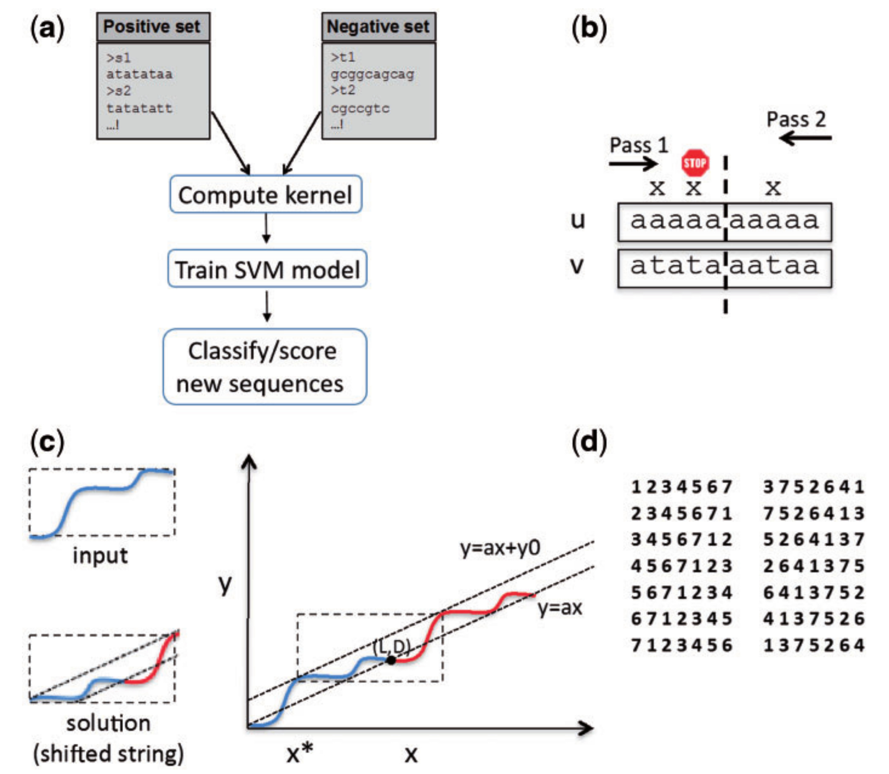

# gkmSVM-R
## Introduction
Oligomers of length k, or *k*-mers, are convenient and widely used features for modeling the properties and functions of DNA and protein sequences. However, *k*-mers suffer from the inherent limitation that if the parameter *k* is increased to resolve longer features, the probability of observing any specific *k*-mer becomes very small, and *k*-mer counts approach a binary variable, with most *k*-mers absent and a few present once. Thus, any statistical learning approach using *k*-mers as features becomes susceptible to noisy training set *k*-mer frequencies once *k* becomes large. To address this problem, alternative feature sets using gapped *k*-mers, a new classifier, gkm-SVM, and a general method for robust estimation of *k*-mer frequencies. 
This repository contains a R implementation of a gkmSVM-R. The implemented model described and detailed explanation of the architecture can be found in the paper ["gkmSVM: an R package for gapped-kmer SVM"](https://www.ncbi.nlm.nih.gov/pmc/articles/PMC4937197/). 

The pipeline overview of the model is explained in this **Figure 1** from the paper:

<p align="center">

</p>
<p align="center"><b>Figure: The model workflow</b></p>

## 1. Environment setup

Installation for linux or mac (R version 3.5-4.0):

### 1.1 Installation of Bioconductor packages:

Enter R in your terminal and run all the installation commands to successfully install bioconductor **R packages**

```
R
if (!requireNamespace("BiocManager", quietly = TRUE)) install.packages("BiocManager")

BiocManager::install()

install.packages('ROCR')
install.packages('kernlab')
install.packages('seqinr')
install.packages('gkmSVM')
BiocManager::install("BSgenome.Athaliana.TAIR.TAIR10.1") # Bioconductor version (3.12) is required
quit()
```
### 1.2 Installation of gkmSVM package in **terminal**:

```
unzip gkmSVM.zip
```
-- or --

### 1.3 Installation of gkmSVM package in **R**:

```
install.packages('gkmSVM')
```
## 2. Data information

### 2.1 Data processing

- To construct your own negative dataset with GC, length, and repeat matched as positive set and extract fasta sequence files for TF_pos.fa and TF_neg.fa: (Larger negative sets can be generated by increasing xfold, and running time can be decreased by reducing nMaxTrials, at the cost of not matching difficult sequences. In general training on larger sequence sets will produce more accurate and robust models). In this case, run the following command:

**Usage:**
Run the following commands in **R** environment in parent directory:

```
R
library(gkmSVM) 
library(BSgenome.Athaliana.TAIR.TAIR10.1)
genNullSeqs('example/ABF2_pos.bed',nMaxTrials=10,xfold=1,genome = BSgenome.Athaliana.TAIR.TAIR10.1, outputPosFastaFN='example/ABF2_pos.fa', outputBedFN='example/ABF2_neg.bed', outputNegFastaFN='example/ABF2_neg.fa')
```
## 3. Model Training Based on Support Vector Machine (SVM)
#### 3.1 Training of the model
**Input:** `ABF2_pos.fa`,`ABF2_neg.fa`. 
All data input files need to be placed in the same folder before training, such as in [example/]. If you are trying to train gkmSVM with your own data, please process your data into the same format as it.
- Calculate kernel matrix using following commond line:
 
```
gkmsvm_kernel('example/ABF2_pos.fa','example/ABF2_neg.fa', 'output/ABF2_kernel.out')
```
**Output:**
**Final result** 
The kernel output for positive and negative dataset, `ABF2_kernel.out`, is saved to `output/` directory. 
 
- Perform SVM training with cross-validation:
 
```
gkmsvm_trainCV('output/ABF2_kernel.out','example/ABF2_pos.fa','example/ABF2_neg.fa',svmfnprfx='example/ABF2', outputCVpredfn='output/ABF2_cvpred.out', outputROCfn='output/ABF2_roc.out', outputPDFfn = 'output/ABF2_ROC2.pdf')
quit()
```

- To calculate the **evaluation metrics** for your test dataset, use previously generated prediction scores (output/ABF2_cvpred.out) and run following commands.
```
awk '{print $3"\t"$2}' output/ABF2_cvpred.out | grep "^1" > output/ABF2_pos_gkmpredict.txt # prediction score for positive dataset
awk '{print $3"\t"$2}' output/ABF2_cvpred.out | grep "^-1" > output/ABF2_neg_gkmpredict.txt # prediction score for negative dataset
python3 evaluate.py -p output/ABF2
```

**Output:** 

**Final result** 

The prediction file on test dataset `ABF2_cvpred.out`, are saved to `output/` directory. The ROC output and ROC plot, `ABF2_roc.out`, `ABF2_ROC2.pdf`, are also saved to `output` diretcory, respectively.
The outfile file `ABF2_result.txt` located at `output/` directory contains the performance metrics of the test dataset.  

#### 3.2 *k*-mer classification
- Generate 10-mer weights:
 Download the `nr10mers.fa`(http://www.beerlab.org/gkmsvm/downloads/nr10mers.fa)  in the `example/` directory
```
cd example/
wget http://www.beerlab.org/gkmsvm/downloads/nr10mers.fa
cd ../
```
Now classify the input sequences in 10kmers
```
R
library(gkmSVM)
gkmsvm_classify('example/nr10mers.fa',svmfnprfx='output/ABF2', 'output/ABF2_weights.out')
quit()

sort -grk 2 output/ABF2_weights.out | head -12
```

which should give weights very similar to:

 

CACCTGGTGG 5.133463

CACCAGGTGG 5.090566

CACCAGGGGG 5.038873

CCACTAGGGG 4.833398

CCACCAGGGG 4.832404

CACCTAGTGG 4.782613

CACCAGAGGG 4.707206

CACTAGGGGG 4.663015

CACTAGAGGG 4.610800

CACTAGGTGG 4.580834

CCACTAGAGG 4.529869

CAGCAGAGGG 4.335304

 
## Citation

If you use gkmSVM in your research, please cite the following paper:</br>
"[Enhanced Regulatory Sequence Prediction Using Gapped k-mer Features](https://journals.plos.org/ploscompbiol/article?id=10.1371/journal.pcbi.1003711)",
PLOS Computational Biology 10, no. 7 (2014): e1003711 :<br/>
"[gkmSVM: an R package for gapped-kmer SVM](https://www.ncbi.nlm.nih.gov/pmc/articles/PMC4937197/)",
Bioinformatics, 32(14): 2205–2207 (2016).
