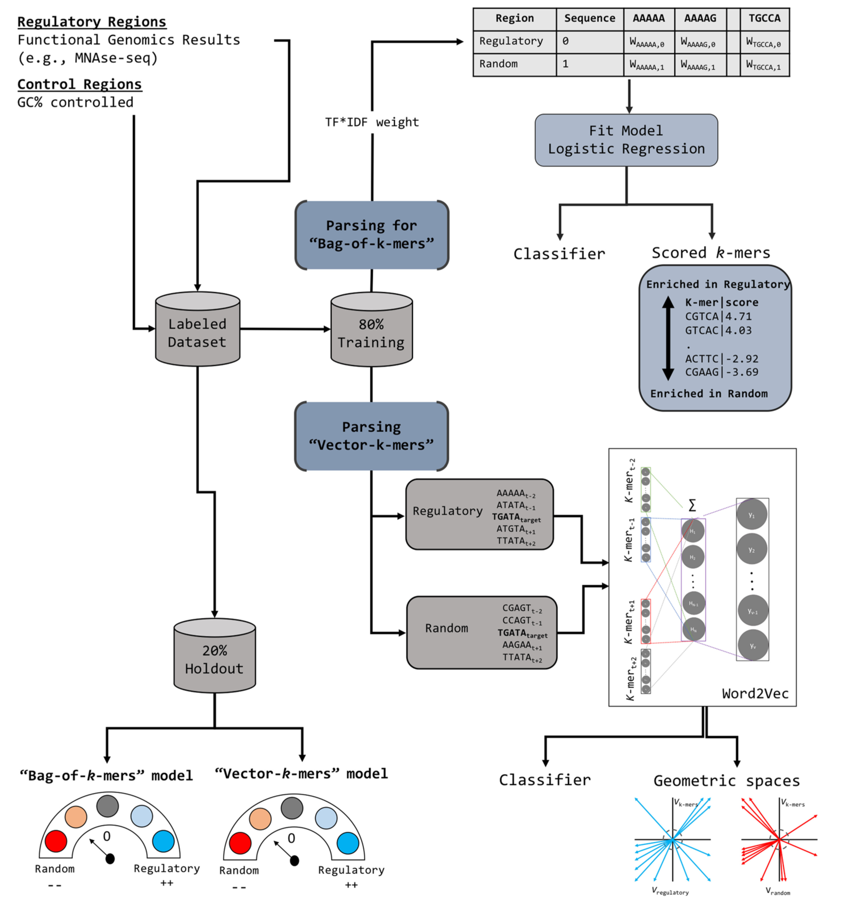

# *k*-mer grammar

## Introduction
The architecture of the model and the calibration phase steps are explained in this **Figure 1** from the paper:

<p align="center">

</p>
<p align="center"><b>Figure: The model workflow</b></p>

## 1. Environment setup

#### 1.1 Create and activate a new virtual environment

Users have their own choice of how to install required packages. But to efficiently manage the installation packages, Anaconda is recommended. After installing Annocoda, it would also be an good option to use virtual environment in annocoda. `conda activate` can be used to activate a virtual environment, and then install required packages. If users want to exit the virtual environment, simply type `conda deactivate`. 

#### 1.2 Software Requirements

***software list***
- python >=3.6
- sqlalchemy
- numpy 
- pandas
- sklearn
- scipy 
- matplotlib

#### 1.3 Installation the package

After downloading and extracting the source codes and move to parent directory, type:

```
unzip k-mer_grammar.zip
```

## 2. Data information

#### 2.1 Data processing

In this part, we will first introduce the **data information** used in this model, then introduce the training **data formats**, and finally introduce how to create a data set that meets the model requirements.

We have provided example data format compatible with k-mer grammar input data format (See `example/ABF2_train.txt`).

Please see the example input files **ABF2_train.txt & ABF2_test.txt** at `example/`. If you are trying to train *k*mer grammar with your own data, please process your data into the same format as it.

Each input file including test and train file having two columns separated by **','** in which first column is: "dna_string" char and second columns is: "bound" integer (either 1 for bound state or 0 for non-bound state).

## 3. Model Training  
#### 3.1 Train and test a "bag-of-*k*-mers" model
To find how to train a "bag-of-*k*-mers" model type, run following command:

```
python3 kgrammar_bag-of-k-mer_training_testing.py -help
```
This command will help to understand the algorithm's all information and its usage.

To get:

**Usage:**
``` 
python3 kgrammar_bag-of-k-mer_training_testing.py [kmersize: integer] [mode filtered: 'True', or 'False' (i.e., mode full)] [dataset_name: string]
```
**Example:**
``` 
python3 kgrammar_bag-of-k-mer_training_testing.py 8 False ABF2
```

**Output**

**Final result** The above example will train a model with k=8 without filtering k-mers by complexity and reading the file under `example/`. The resulting model file `kgrammar_bag-of-k-mers_LR_mode_full_ABF2_8_1688192717.pkl` will be saved to `output/` directory together with a database that contains *k*-mer weights `kgrammar_bag-of-k-mers_weights_mode_full_ABF2_8_1688192717.db`.
 
After training the model, results of the test dataset containg accuracy and others metrics (including confusion matrix) will be saved to `ABF2_grammar_result.txt` and to the log file located at `output/` directory.

#### 3.2 Train and test a "vector-*k*-mers" model

To find how to train a "vector-*k*-mers" model type:
```
python3 kgrammar_vector-k-mer_training_testing.py -help
```
To get:

**Usage:**
```
python3 kgrammar_vector-k-mers_training_testing.py [kmersize: integer] [windowsize: integer] [kmer_parsing: 'True' for kmer, 'False' for newtokens] [dataset_name: string]
```
**Example:**
```
python3 kgrammar_vector-k-mer_training_testing.py 8 5 False ABF2
```
**Output**

**Final result** The above example will train a model with k=8, window size=5, using uncollapsed *k*-mers and reading the file under `example/`. The vectors for the positive and control sequences will be saved to `output/` directory together with the `ABF2_vector_result.txt` that consists of performance metrics. After training the model, the script with proceed to test and save ROC and PR curves at the same `output/` directory.

## Citation

If you use *k*-mer grammar in your research, please cite the following paper:</br>
"[A *k*-mer grammar analysis to uncover maize regulatory architecture](https://www.nature.com/articles/nbt.3300)",
BMC Plant Biology 19, Article number: 103 (2019).<br/>
