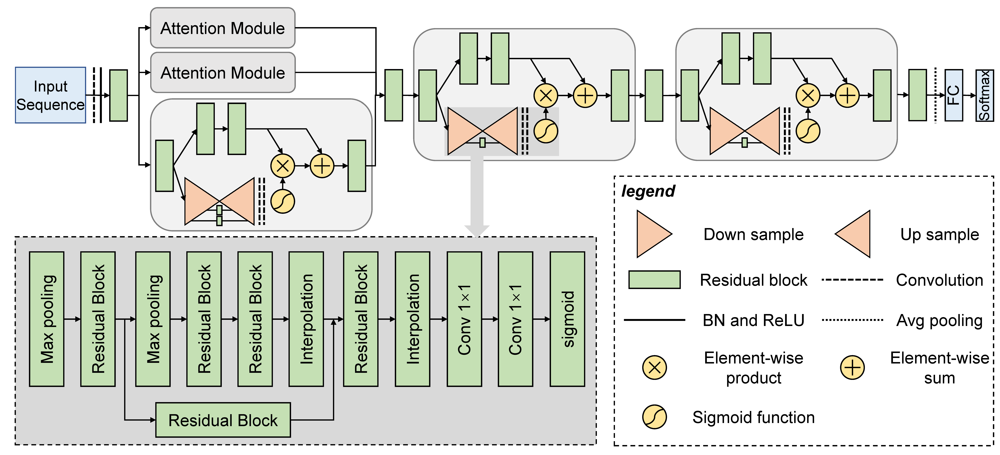

# MAResNet
The architecture of MAResNet are explained in this **Figure 1** from the paper:
<p align="center">

</p>
<p align="center"><b>Figure: The model workflow</b></p>

## 1. Environment setup

We recommend that you use [conda](https://docs.conda.io/en/latest/) to install all of the following software.

#### 1.1 Create and activate a new virtual environment

```
conda activate
```
#### 1.2 Install the package and other requirements

Run command to install pytorch

```
python3 -m pip install --pre torch torchvision -f https://download.pytorch.org/whl/nightly/cu111/torch_nightly.html -U
```

Download and extract the source code for MAResNet and move to parent directory, type following commands:
```
unzip maresnet.zip
```

#### 1.3 Software Requirements

***software list***

The required dependencies for MAResNet are in requirements.txt file.

torchvision==0.9.1      
pandas==1.2.3
numpy==1.20.2           
torch==1.8.1
scikit_learn==0.24.2


## 2. Data information

#### 2.1 Data processing
In this part, we will first introduce the **data information** used in this model, then introduce the training **data formats**, and finally introduce how to create a data set that meets the model requirements.

We have provided example data format compatible with MAResNet input data format (See [example input data](https://github.com/SCBB-LAB/comparative_analysis_of_plant_TFBS_software/maresnet/blob/master/example/ABF2/train.data)). If you are trying to train MAResNet with your own data, please process your data into the same format as it and construct your data into `train.data` , `test.data` and `valid.data`.

#### 2.2 Model Training Based on Top-down and bottom-up attentation mechanism and residual network

- **Input and output data repositories**

Make sure to make directories to store your input data and output results before model training

**Input data directory**
```
mkdir example/
```
**Output data directory**
```
mkdir output/
```
- **Training** 
**Input:** `train.data`, `test.data` and `valid.data`.
All data files need to be placed in the same folder before training, such as `example/ABF2`.

#### 2.3 Training MAResNet on plant TF datasets

If you want to train this model on your dataset, you need to keep these three input files to `example/ABF2/` directory for each TF specific data and along with all the three input files for different TFs into their respective directories into `example/` directory.

**Usage:**
Run following command in the parent directory:

```
python3 train_on_cell_datasets.py
```

**Output**

**Final result** The resulting model files (`maresnet-epoch_number-regular.pth`) will be saved to `output/checkpoint/ABF2/` directory together with a regular and best models.
 
After training the model, result of the test dataset containing accuracy and others metrics (including confusion matrix) at each epoch will be saved to `result.csv` located at `output/checkpoint/ABF2/` directory.
The prediction score for test dataset (`bestiter.pred`) and the log file (`df_log2.csv`) containing performance metrics at one best epoch will save in (`runs/maresnet/ABF2/`) directory.

## Citation
If you use MAResNet in your research, please cite the following paper:</br>
<br/>
[MAResNet: predicting transcription factor binding sites by combining multi-scale bottom-up and top-down attention and residual network](https://academic.oup.com/bib/article/23/1/bbab445/6399874)",<br/>
Briefings in Bioinformatics 23, no. 1 (2022).
